# Sequencer Tutorial

Based on popular demand, here is a quick step-by-step tutorial to correctly setup a sequence of OpenVDB files in Unreal's `Sequencer`, how to use it with the path-tracer, and how to render a high quality movie with it.

## Context

I'm really happy to see that the VFX and the offline rendering community has shown a lot of interest for this plugin, 
and particularly in the pathtracer mode using the `Sequencer` because it allows baking high-quality images and sequences
of images with realtime tools and realtime preview. 

As a reminder, only `VdbPrincipledActors` are compatible with Unreal's pathtracer. 
These actors do not use Unreal materials, they use a physically based hard-coded shader with parameters
exposed directly in the `VdbPrincipledComponent`.  

 
## Prerequisites

You need to [install and enable](README.md#Installation) this plugin.

Import any sequence in the editor, please refer to [this documentation](README.md) if you don't know how to.

In this tutorial, I will use [Embergen's Gasoline explosion](https://jangafx.com/software/embergen/download/free-vdb-animations/).
I'm only importing the `Density` and `Temperature` grids, we will not use the `Flames` grid.

## Step by step tutorial

### Step 1. Create new Actor

The first step is to create a new `VdbPrincipledActor`. 

### Step 2. Set correct `VdbVolumes` in `VdbPrincipledComponent`

In our case, 
* `Vdb Density` should link to `embergen_gasoline_explosion_a_seq_density`
* `Vdb Temperature` should link to `embergen_gasoline_explosion_a_seq_temperature`.
 
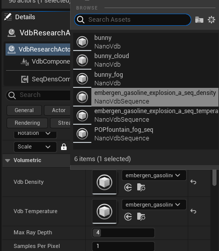

In general cases, `Vdb Density` is mandatory but `Vdb Temperature` is **optional**. 
Temperature will not be sampled if not defined. For example, Clouds don't use Temperature information. 

### Step 3. Check your VDB Sequence

Most `VdbVolumeSequences` will start with an empty or very small volume on the first frame. 
I recommend offseting your sequence so that you can actually see your volume. 
It is configurable in the `Playback` panel, with the `Offset` parameter.

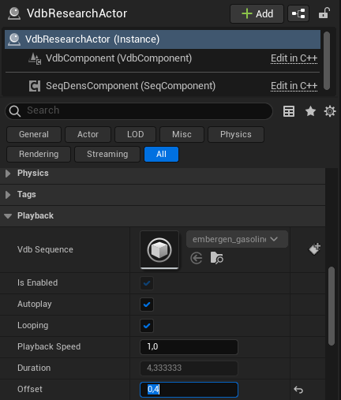

### Step 4. Check Volume orientation

Once you can see your volume, you will probably notice some issues with the volume orientation.
Unreal uses a different coordinate systems than most other Digital Content Creator tools. 
Your imported VDB files will probably be rotated or flipped, 
use the `Actor Transform` to fix orientation.   

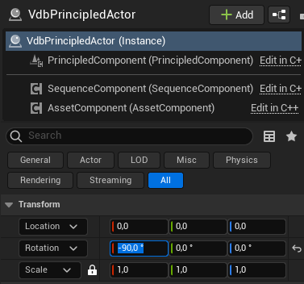

### Step 5. Enable Pathtracer

Enable your pathtracer, [following Epic's instructions](https://docs.unrealengine.com/4.27/en-US/RenderingAndGraphics/RayTracing/PathTracer/).

#### Before
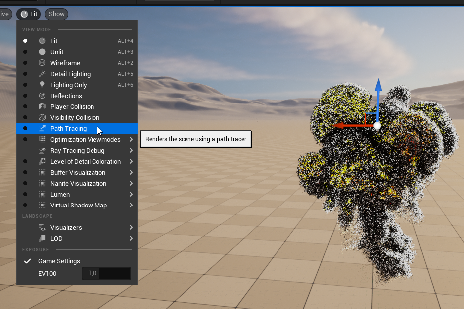

#### After
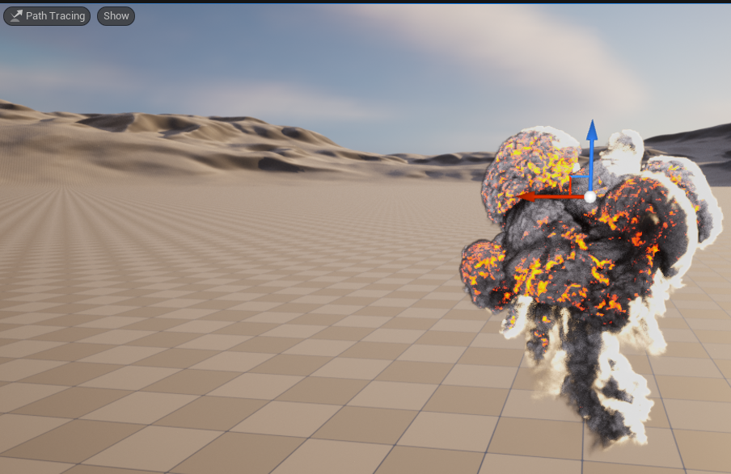

### Step 6. Make it look good

Depending on your volume type (smoke, fog, cloud etc.), tweak the rendering options available in the component,
 mostly under `Principled Volume`.

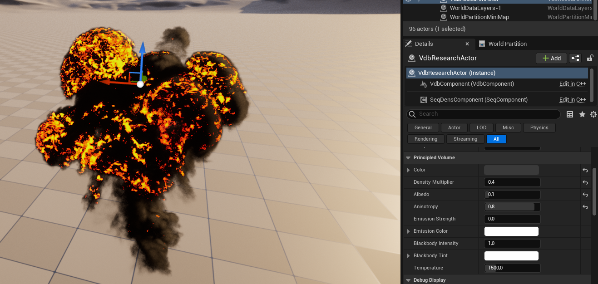

### Step 7. Create and use a Sequence

It is now time to create a sequence to be able to control the animation, using the [Sequencer](https://docs.unrealengine.com/4.27/en-US/AnimatingObjects/Sequencer/Overview/).

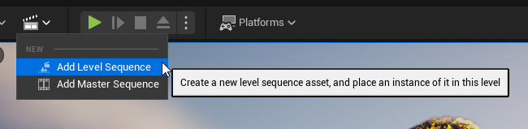

We can now add (`Track` in Unreal terms) our `VdbPrincipledActor` in the `Sequencer`.

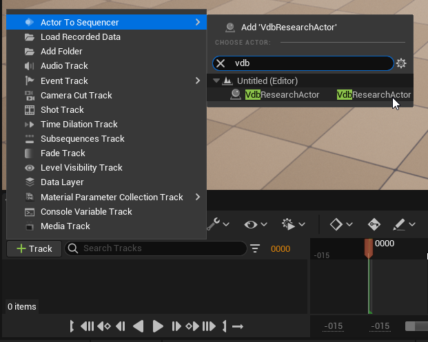

### Step 8. Add VDB sequence in Sequencer

When adding a `Track` on your `VdbPrincipledActor`, you can simply select `Tracks/Vdb Sequence`, 
as explained [here](README.md#sequencer_density).

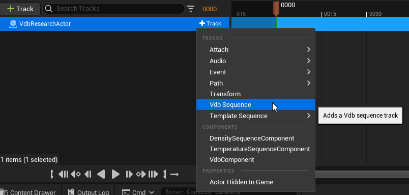

This tracked sequence will drive **all Volumes sequences** from your Actor.

### Step 9. Use the Sequencer

Your `Sequencer` should now be working, and you can use the timeline to browse through the animation.

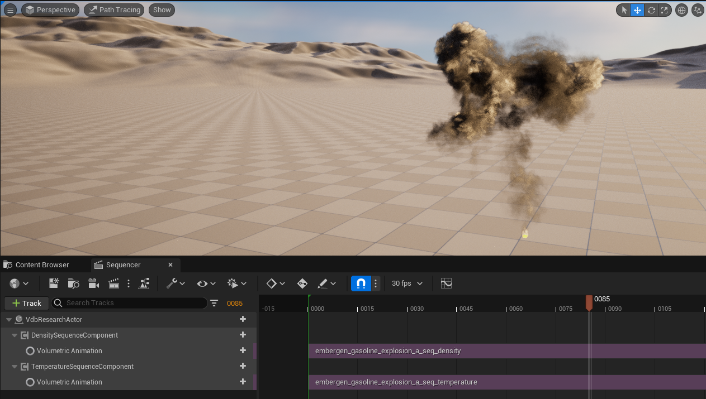

Warning: There is currently an issue where changing frames in the sequencer doesn't reset the pathtracer view. 
I've informed Epic and [they fixed it](https://github.com/EpicGames/UnrealEngine/commit/23dba4db228ec6f6df7eec632ebb5fb15dba47f1), but it's not available in the current release yet, hopefully in the next one.

  
### Step 10. Add cinematic camera

To finalize the `Sequence`, you need to add a `Cinematic Camera` (choose the one you prefer). 
 
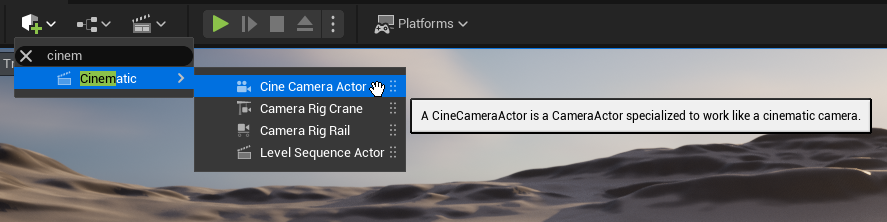

Place the camera correctly in the world so that the VDB sequence fits in the frame. 
I recommend using the `Pilot` option to easily move the Camera and see the results live.

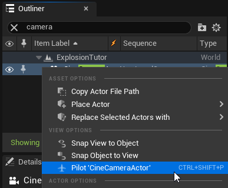

Then add (`Track`) it to your `Sequence`:

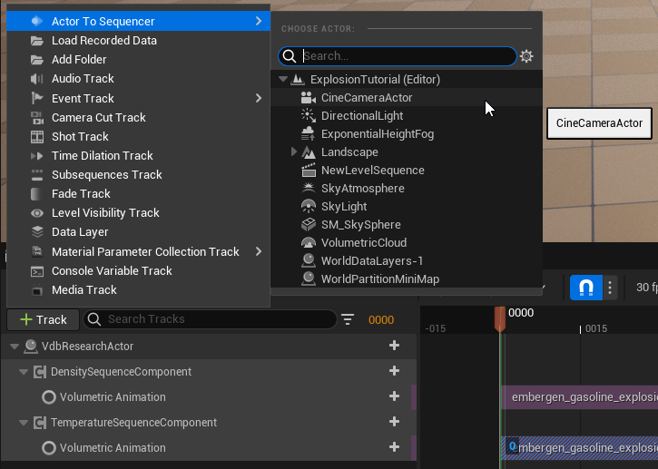

You are now ready to use and render the `Sequence`.
 
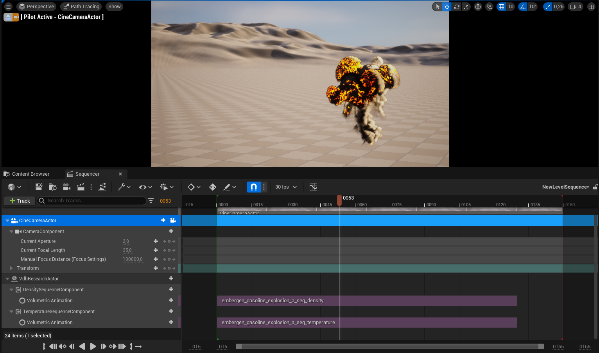

### Step 11. Using the Movie Render Queue (MRQ)

You can now render and bake your `Sequence`, for a trailer, a cinematic, a short film etc.

As always, I recommend reading the [Epic documentation](https://docs.unrealengine.com/4.26/en-US/AnimatingObjects/Sequencer/Workflow/RenderAndExport/HighQualityMediaExport/), especially the 
[section that combines the MRQ with the pathtracer](https://docs.unrealengine.com/4.27/en-US/RenderingAndGraphics/RayTracing/PathTracer/#path-tracedrendersusingmovierenderqueue).

Once the plugin is activated, open the `Movie Render Queue` panel, and select your `Sequence` to be rendered:

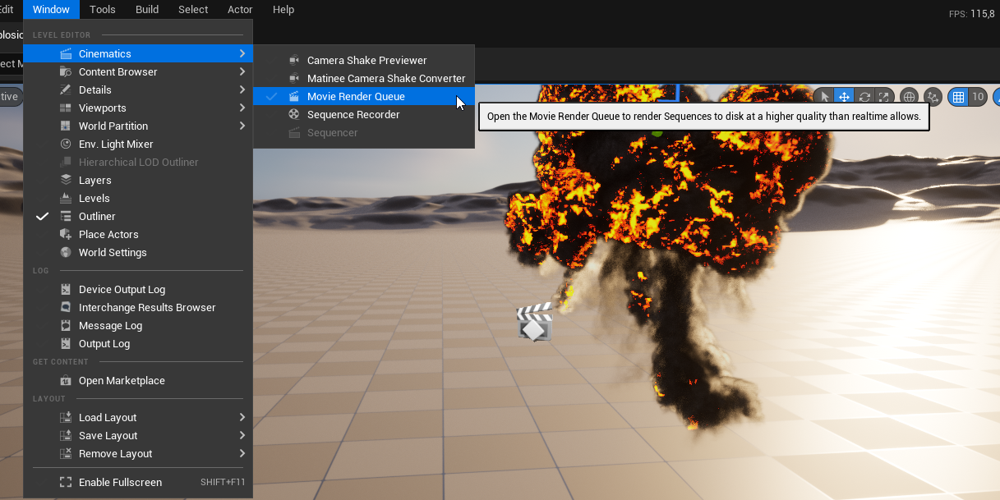
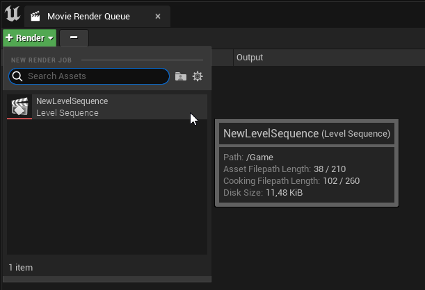

For reference, I use these basic settings to bake our example `Sequence`. 

## Conclusion

This is it, you can now render any sequence of OpenVDB (or NanoVDB) files in Unreal, in combination with the pathtracer.

I hope this tutorial was clear enough and will help you set up your own animations easily. 
I'm always happy to see what the community comes up with, so feel free to share your results on social media !

